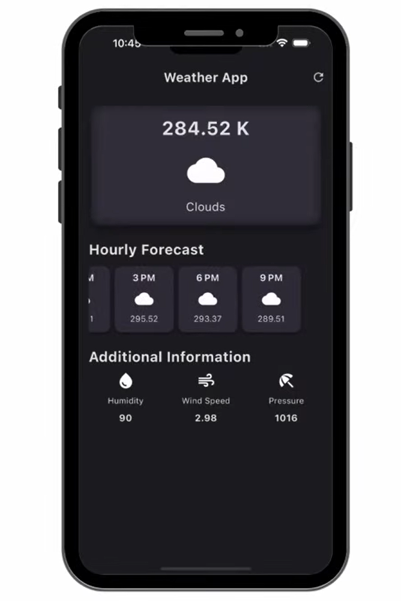

1️⃣ Weather App 🌤️

Project Name: Weather App
Tech Stack: Flutter, Dart, HTTP (for API calls)

Description

A simple Flutter app that fetches weather information from a public API and displays it in a clean, user-friendly interface. This project was built to practice working with APIs, asynchronous programming, and dynamic UI updates in Flutter.

Features

Fetch real-time weather data by city

Display temperature, weather conditions, and icon

Clean, responsive UI

Error handling for invalid city names

Screenshots / Demo

(Optional: add a GIF or Loom video link here for live demo)

Getting Started

Clone the repo:

git clone https://github.com/YOUR_USERNAME/weather-app.git

Navigate to the project folder:

cd weather-app

Get dependencies:

flutter pub get

Run the app:

flutter run
